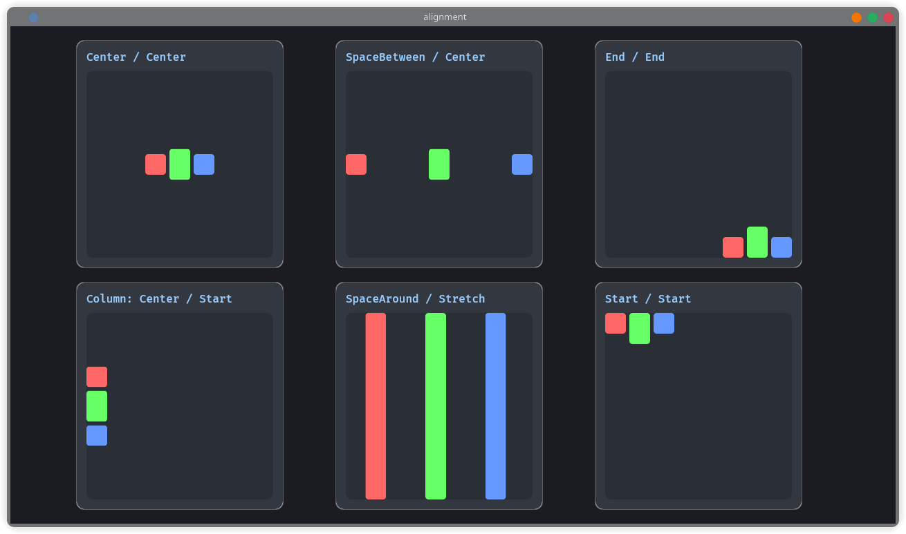

# 🎨 Univis UI

[](https://crates.io/crates/univis_ui)
[](https://bevyengine.org/)
[](LICENSE)

**Univis** is a "hybrid" (Hybrid) framework for user interfaces in the Bevy engine.



The library acts as a bridge between the ease of traditional 2D UI layouts and the power of 3D world objects. With Univis, you write standard ECS code using Flexbox and Grid layouts, but the result is drawn as meshes supported by SDF technology within the game world.

**No pixelation. No separate drawing stages. Just pure Bevy ECS entities.**

---

## 🧬 The Hybrid Advantage

Univis is designed for developers looking for a development experience (DX) similar to UI libraries, with the visual quality of game meshes.

### 1. Writing as a User Interface...
Layout is defined using familiar concepts like **Padding**, **Margin**, **Flex**, and **Grid**.

### 2. ...Rendered as a 3D Mesh
Behind the scenes, each element is a `Mesh2d` with a custom SDF shader. This means:

- ✨ **Infinite resolution** - Sharp edges no matter how close the camera
- 💡 **Lighting interaction** - Responsive to 3D lighting and effects (Bloom & Glow)
- 🌍 **Native world presence** - Lives naturally in World Space
- 🦾 **Physics interaction** - Compatible with RigidBodies and Colliders
- ⚡ **Native to Bevy** - 100% compatible with ECS

---

## ⚡ 100% Native to Bevy and ECS

No "Shadow DOM" or complex external state:

- **Entities**: Every button, text, or container is a regular Bevy entity
- **Components**: Layouts through components (`UNode`, `UBorder`, `ULayout`)
- **Systems**: Layout solving via standard Bevy systems
- **Queryable**: Querying `&mut UNode` just like `Transform`

---

## ✨ Key Features

### 📐 Advanced Layout Engine

A solver system supporting multiple layout styles:

| Style     | Description                   | Ideal Use Case                  |
|-----------|-------------------------------|----------------------------------|
| **Flex**  | Flexible row/column layout     | Lists, bars, traditional layouts |
| **Grid**  | Grid with fixed columns        | Image galleries, dashboards      |
| **Radial**| Circular distribution          | Weapon lists, sci-fi reactors    |
| **Masonry**| Height-based tiling           | Pinterest layouts                |
| **Stack** | Stacking on top of each other  | Nested layers                    |

```rust
// Example: Three-column Grid
ULayout {
    display: UDisplay::Grid,
    grid_columns: 3,
    gap: 10.0,
    ..default()
}
```

### 🎨 SDF Rendering

Round corners, soft shadows, and mathematically calculated borders for each pixel with extreme precision:

```rust
UNode {
    border_radius: UCornerRadius {
        top_left: 20.0,      // Independent corner radius
        top_right: 0.0,
        bottom_right: 20.0,
        bottom_left: 0.0,
    },
    ..default()
}
```

### 🖱️ Built-in Interaction System

Precise picking with meshes:

```rust
commands.spawn((
    UNode::default(),
    Pickable::default(),
))
.observe(|_: On<Pointer<Click>>| {
    println!("Clicked!");
});
```

### 📝 Automatic Sizing

Text and containers adapt dynamically to content:

```rust
UNode {
    width: UVal::Content,  // Sized based on content
    height: UVal::Auto,    // Fills available space
    ..default()
}
```

---

## 🚀 Quick Start

### Installation

```toml
[dependencies]
bevy = "0.17"
univis = "0.1.0"
```

### Simple Example

```rust
use bevy::prelude::*;
use univis::prelude::*;

fn main() {
    App::new()
        .add_plugins(DefaultPlugins)
        .add_plugins(UnivisUiPlugin)
        .add_systems(Startup, setup)
        .run();
}

fn setup(mut commands: Commands) {
    commands.spawn(Camera2d);

    // Root interface
    commands.spawn((
        UScreenRoot,
        UNode {
            width: UVal::Percent(1.0),
            height: UVal::Percent(1.0),
            background_color: Color::srgb(0.1, 0.1, 0.1),
            padding: USides::all(20.0),
            ..default()
        },
        ULayout {
            display: UDisplay::Flex,
            justify_content: UJustifyContent::Center,
            align_items: UAlignItems::Center,
            ..default()
        },
    ))
    .with_children(|parent| {
        // Square with rounded corners
        parent.spawn(UNode {
            width: UVal::Px(300.0),
            height: UVal::Px(200.0),
            background_color: Color::srgb(0.2, 0.5, 0.9),
            border_radius: UCornerRadius::all(16.0),
            ..default()
        });
    });
}
```

---

## 📂 Examples

The library includes a set of illustrative examples:

```bash
# Basic Example
cargo run --example minimal

# Dashboard with Grid
cargo run --example dashboard

# Sci-fi UI with Radial
cargo run --example sci_fi_hud
```

All examples are available in the `examples/` folder in the repository.

---

## 🆚 Comparison: Univis vs Bevy UI

| Feature                  | Bevy UI                  | Univis UI                        |
| ------------------------ | ------------------------ | -------------------------------- |
| **Rendering Technology** | Rasterized (blurs in 3D) | SDF Shaders (infinite precision) |
| **Space**                | Screen Space / 2D layer  | World Space / Screen Space       |
| **Lighting**             | Not lit                  | Responds to 2D lighting          |
| **Physics**              | No interaction           | Compatible with Colliders        |
| **Layout**               | Flexbox only (Taffy)     | Flex + Grid + Radial + Masonry   |
| **Corners**              | Uniform                  | Independent corners              |

### ✅ Univis is suitable for:

- Sci-fi HUDs, holograms, cockpit displays
- Interfaces requiring tilting, rotation, or physics interaction
- Need for sharp and smooth rounded corners even at high zoom levels
- Diegetic UIs (in-world screens)

### ❌ Bevy UI is better for:

- Traditional main menus, inventory grids, development tools
- Complex scrollable lists (Univis is still working on this)
- Pure 2D interfaces not requiring 3D interaction

---

## ⚠️ Project Status: Alpha v0.1.0

Univis is powerful but experimental right now. It's designed for specific use cases (HUDs, in-game screens) and not for building general-purpose complex applications.

| Feature                  | Status          | Notes          |
|--------------------------|-----------------|----------------|
| Flex/Grid/Radial Layouts  | ✅ Stable       | Strong and fast|
| SDF Rendering             | ✅ Stable       | Infinite precision|
| Text Labels               | ✅ Stable       | Wrapper around Bevy Text2d|
| Clipping (Scroll Views)   | 🚧 In Progress  | Work in progress with shader clipping|
| Text Input                | 🚧 In Progress  | Planned for future updates|

---

## 🛠️ Advanced Sizing Modes

Univis supports smart, flexible sizing modes:

```rust
// Fixed pixels
UVal::Px(200.0)

// Percentage of parent
UVal::Percent(0.5)  // 50%

// Content-based sizing
UVal::Content  // Based on children

// Auto - fills available space
UVal::Auto

// Flexible - takes a share of remaining space
UVal::Flex(1.0)
```

### Example: Flexible Layout

```rust
commands.spawn((ULayout::default(), UNode::default()))
    .with_children(|parent| {
        // 25% of space
        parent.spawn(UNode {
            width: UVal::Flex(1.0),
            ..default()
        });
        
        // 50% of space
        parent.spawn(UNode {
            width: UVal::Flex(2.0),
            ..default()
        });
        
        // 25% of space
        parent.spawn(UNode {
            width: UVal::Flex(1.0),
            ..default()
        });
    });
```

---


Now the interface:
- ✅ Responds to lighting
- ✅ Can be tilted and rotated
- ✅ Can have Colliders added
- ✅ Renders with high precision from any angle

---

## 🎨 Advanced Design

### Borders

```rust
UBorder {
    color: Color::WHITE,
    width: 2.0,
    radius: UCornerRadius::all(12.0),
    offset: 0.0,
}
```

### Margins & Padding

```rust
USides::all(16.0)           // All sides
USides::axes(20.0, 10.0)    // Horizontal, Vertical
USides::row(15.0)           // Left and right only
USides::column(15.0)        // Top and bottom only
```

### Absolute Positioning

```rust
USelf {
    position_type: UPositionType::Absolute,
    left: UVal::Px(20.0),
    top: UVal::Px(20.0),
    ..default()
}
```

---

## 🤝 Contributing

Contributions are welcome! Especially in:
- Clipping support (Scroll Views)
- Image support
- Performance improvements
- New examples

To contribute:
1. Fork the repository
2. Create a feature branch
3. Commit changes
4. Push and create a pull request

---

## 📄 License

Licensed under [MIT](LICENSE-MIT) and [Apache 2.0](LICENSE-APACHE).
