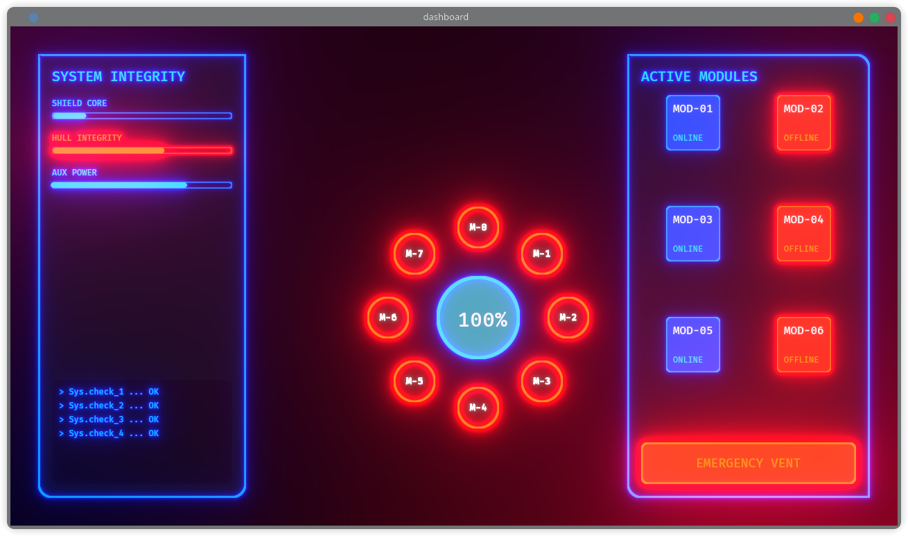

<<<<<<< HEAD
=======

>>>>>>> 0f2b371 (update cargo.toml)
# Univis UI
[](https://crates.io/crates/univis)
[](https://bevyengine.org/)
[](LICENSE)
**Why Univis UI and what is it?**

---
> **important** ⚠️.
> This version is still very early (**Alpha**).
> Before any update, make sure to back up your data.
---
<<<<<<< HEAD
from example `cargo run --example card_profile`


from example `cargo run --example sci_fi`
=======
form example `cargo run --example card_profile`


form example `cargo run --example sci_fi`
>>>>>>> 0f2b371 (update cargo.toml)


###### What is it?
It is an open-source framework built entirely on ECS and fully integrated with all Bevy features. It provides a layout system to simplify building interactive interfaces and computer screens inside games.

---
###### Why Univis UI?
Providing an integrated layout system with Bevy saves 90% of the effort and time that would otherwise be wasted. Univis UI relies on shaders, mesh2d, and mesh3d. Building holographic or VR/XR interfaces is no longer a nightmare thanks to Univis UI. The same code can interact with light and physics, or work in ScreenSpace, WorldSpace, 3D camera, or 2D camera, all with the same code.

---
###### Usage in Spaces
Specify the display type in the space:

   - In ScreenSpace
``` rust
// In ScreenSpace, it is necessary to use Camera2d
commands.spawn(Camera2d);
// Here we specify the root 
// We use the UScreenRoot tag to handle layout based on the screen and its size
commands.spawn(UScreenRoot)
   .with_children(/* your code*/);
<<<<<<< HEAD
```
- In WorldSpace
``` rust
// In WorldSpace
// You can use either camera2d or camera3d
// depending on your needs
commands.spawn(Camera3d);
// Here we specify the root 
// We use the UWorldRoot tag to handle layout based on the UWorldRoot measurements
// to specify the layout area size

commands.spawn(
    // Specify the UWorld tag for the game world
    UWorldRoot {
       // Specify the layout area size
       size: Vec2::new(400.0,300.0),
       // Specify if the layout targets camera3d or camera2d
       is_3d: true,
       ..default()
    }
).with_children(/* your code*/);
=======
>>>>>>> 0f2b371 (update cargo.toml)
```
- In WorldSpace
``` rust
// In WorldSpace
// You can use either camera2d or camera3d
// depending on your needs
commands.spawn(Camera3d);
// Here we specify the root 
// We use the UWorldRoot tag to handle layout based on the UWorldRoot measurements
// to specify the layout area size

<<<<<<< HEAD
- #### Layout
Univis has its own layout system with **nodes, units, and widgets**

``` rust
// This is the most important layout element, like Node in bevy_ui
UNode::default()
```
Univis UI does not provide everything in `UNode` for organizing children 
``` rust
ULayout::default()
// This component contains all the essential layout elements that are applied to children
```
Rebellious children
``` rust 
USelf::default()
// This component is responsible for enforcing a specific arrangement for the child, like absolute positioning
```
=======
commands.spawn(
    // Specify the UWorld tag for the game world
    UWorldRoot {
       // Specify the layout area size
       size: Vec2::new(400.0,300.0),
       // Specify if the layout targets camera3d or camera2d
       is_3d: true,
       ..default()
    }
).with_children(/* your code*/);
```
- #### Layout
Univis has its own layout system with **nodes, units, and widgets**

``` rust
// This is the most important layout element, like Node in bevy_ui
UNode::default()
```
Univis UI does not provide everything in `UNode` for organizing children 
``` rust
ULayout::default()
// This component contains all the essential layout elements that are applied to children
```
Rebellious children
``` rust 
USelf::default()
// This component is responsible for enforcing a specific arrangement for the child, like absolute positioning
```
>>>>>>> 0f2b371 (update cargo.toml)
Univis supports smart, flexible sizing modes:

```rust
// Fixed pixels
UVal::Px(200.0)

// Percentage of parent
UVal::Percent(0.5)  // 50%

// Content-based sizing
UVal::Content  // Based on children

// Auto - fills available space
UVal::Auto

// Flexible - takes a share of remaining space
UVal::Flex(1.0)
```
# Ready-to-use Examples

<<<<<<< HEAD

=======
>>>>>>> 0f2b371 (update cargo.toml)
``` fish
cargo run --example hello_world
cargo run --example sci_fi
cargo run --example border_light_3d
cargo run --example alignment
cargo run --example card_profile
cargo run --example texture
cargo run --example masonry
cargo run --example interation
```

## 🤝 Contributing

Contributions are welcome! Especially in:
<<<<<<< HEAD
- Clipping support (Scroll Views).
- Performance improvements.
- New examples.
- supportes more widgets.
=======
- Clipping support (Scroll Views)
- Performance improvements
- New examples
>>>>>>> 0f2b371 (update cargo.toml)

To contribute:
1. Fork the repository
2. Create a feature branch
3. Commit changes
4. Push and create a pull request

---

## 📄 License

Licensed under [MIT](LICENSE-MIT) and [Apache 2.0](LICENSE-APACHE).